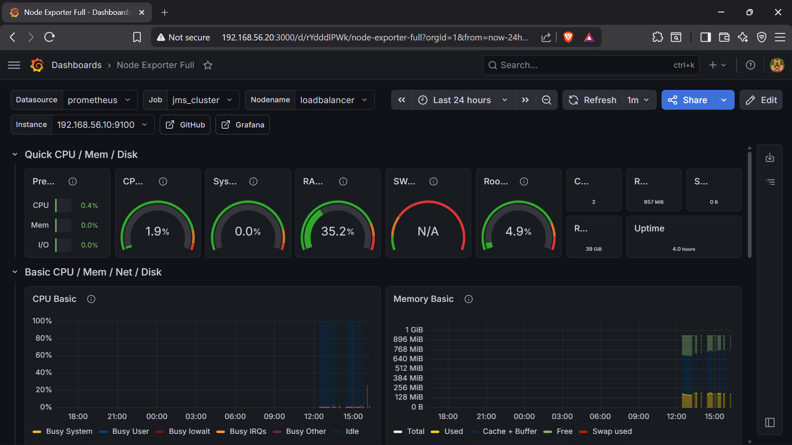
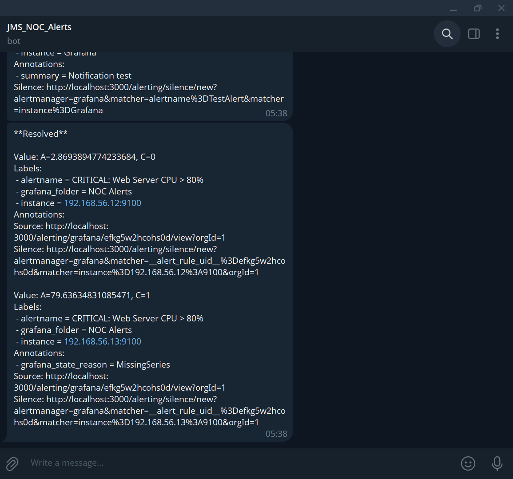
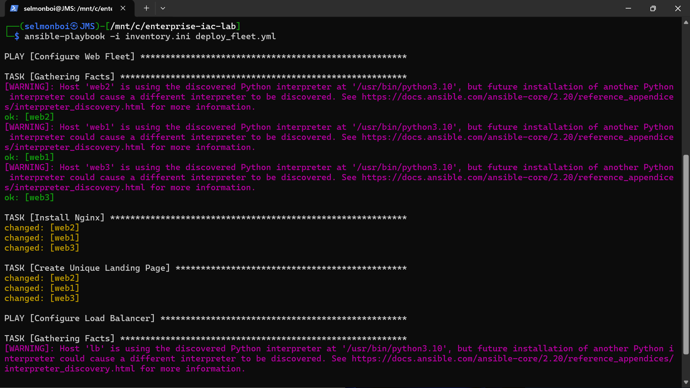
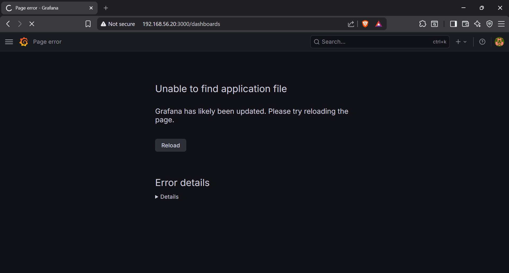

# Enterprise Infrastructure & Monitoring NOC (High Availability Cluster)

**Author:** Jagannath Sarmalkar  
**Tech Stack:** Ansible, Vagrant, Nginx, Prometheus, Grafana, MySQL, PHP, Telegram API

---

## 📌 Project Overview
This project simulates a production-grade, **Highly Available (HA)** enterprise data center deployed entirely on local virtualized hardware. It demonstrates a full-stack DevOps lifecycle: from infrastructure provisioning and automated configuration to real-world observability and incident response.

### 🚀 Core Objectives Achieved
* **Infrastructure as Code (IaC):** Orchestrated a 5-node Ubuntu cluster using Vagrant and VirtualBox.
* **Configuration Management:** Developed idempotent Ansible playbooks for zero-touch deployment.
* **High Availability:** Configured an Nginx Reverse Proxy with Round-Robin load balancing.
* **Observability (NOC):** Engineered a centralized monitoring stack (Prometheus/Grafana) capturing real-time hardware telemetry via PromQL.
* **Automated Incident Response:** Integrated a custom Telegram Bot via Webhooks to push critical CPU/Memory alerts to mobile devices.

---

## 🏗️ Architecture Topology
The environment operates on a private NAT network (`192.168.56.0/24`):

| Node | IP | Role |
| :--- | :--- | :--- |
| **Load Balancer** | `192.168.56.10` | Nginx Reverse Proxy & Traffic Distributor |
| **Web1** | `192.168.56.11` | Application Node (Nginx + PHP-FPM) |
| **Web2** | `192.168.56.12` | Application Node (Nginx + PHP-FPM) |
| **Web3/DB** | `192.168.56.13` | Hybrid Node (App Node + MySQL Database) |
| **NOC Monitor** | `192.168.56.20` | Prometheus TSDB & Grafana Visualization Gateway |

---

## 📸 System Validation & Proof of Concept

### 1. 3-Tier Application & Load Balancing
The dynamic PHP application queries the backend MySQL database to confirm connectivity.


### 2. NOC Monitoring Dashboard
Real-time telemetry capturing cluster health during synthetic load testing.


### 3. Automated Incident Response
Custom Telegram bot receiving JSON payloads from Grafana when CPU thresholds exceed 50%.


### 4. Alerting Logic (PromQL)
The backend logic utilized to trigger real-time alerts.


### 5. Ansible Orchestration
Proof of idempotent execution and automated fleet configuration.


---

## 🚧 Challenges & Engineering Solutions

#### 1. Browser "Keep-Alive" Caching vs. Load Balancing
* **Challenge:** Initial testing showed the browser staying pinned to a single node due to persistent TCP connections.
* **Solution:** Validated Round-Robin logic using a CLI-based `curl` loop:  
    `for i in {1..6}; do curl -s http://192.168.56.10 | grep "Connected to"; done`

#### 2. Host Resource Starvation & OOM Killer
* **Challenge:** Running 5 VMs simultaneously while stress testing caused the Monitor node to lock up (Out-of-Memory).
* **Solution:** Optimized host RAM usage by consolidating the Database onto `web3`. Tuned Grafana refresh intervals to reduce CPU overhead on the monitoring node.


#### 3. Declarative State vs. Service Uptime
* **Challenge:** Killing the Nginx service on `web1` for failover testing didn't trigger a "fix" during a basic playbook run.
* **Solution:** Implemented explicit `state: started` definitions in Ansible service modules to ensure the cluster maintains a "running" status rather than just a "present" status.

---

## 📜 Infrastructure Code (Playbooks)

<details>
<summary><b>View: Load Balancer & Web Fleet Deployment</b></summary>

```yaml
---
- name: Configure Web Fleet
  hosts: webservers
  become: yes
  tasks:
    - name: Install Nginx
      apt:
        name: nginx
        state: present
        update_cache: yes

- name: Configure Load Balancer
  hosts: loadbalancer
  become: yes
  tasks:
    - name: Install Nginx on LB
      apt:
        name: nginx
        state: present

    - name: Setup Reverse Proxy Config
      copy:
        dest: /etc/nginx/sites-available/default
        content: |
          upstream my_web_fleet {
              server 192.168.56.11;
              server 192.168.56.12;
              server 192.168.56.13;
          }
          server {
              listen 80;
              location / {
                  proxy_pass http://my_web_fleet;
              }
          }

    - name: Restart Nginx on LB
      service:
        name: nginx
        state: restarted
```

### MySQL Deployment and Remote Access Configuration

This Ansible playbook automates the installation of the database engine, modifies the networking configuration to allow cross-node communication, and handles the initial SQL schema provisioning.

<details>
<summary><b>Click to view Playbook: setup_db.yml</b></summary>

```yaml
---
- name: Configure Database Tier
  hosts: web3
  become: yes
  tasks:
    - name: Open MySQL to external connections
      lineinfile:
        path: /etc/mysql/mysql.conf.d/mysqld.cnf
        regexp: '^bind-address'
        line: 'bind-address = 0.0.0.0'

    - name: Restart MySQL
      service:
        name: mysql
        state: restarted

    - name: Provision Database & Data
      shell: |
        mysql -e "CREATE DATABASE IF NOT EXISTS enterprise_db;"
        mysql -e "CREATE USER IF NOT EXISTS 'db_user'@'%' IDENTIFIED BY 'Admin123!';"
        mysql -e "GRANT ALL PRIVILEGES ON enterprise_db.* TO 'db_user'@'%';"
        mysql -e "FLUSH PRIVILEGES;"
```

### Dynamic PHP-FPM Configuration

This Ansible playbook automates the installation and configuration of PHP-FPM, dynamically tuning process manager settings based on system resources to optimize web application performance and handle varying traffic loads.

<details>
<summary><b>Click to view Playbook: setup_php_fpm.yml</b></summary>

```yaml
---
- name: Deploy Dynamic PHP Application
  hosts: webservers
  become: yes
  tasks:
    - name: Configure Nginx to use PHP-FPM
      copy:
        dest: /etc/nginx/sites-available/default
        content: |
          server {
              listen 80 default_server;
              root /var/www/html;
              index index.php index.html;
              location ~ \.php$ {
                  include snippets/fastcgi-php.conf;
                  fastcgi_pass unix:/var/run/php/php8.1-fpm.sock;
              }
          }
    - name: Restart Nginx
      service:
        name: nginx
        state: restarted
```
